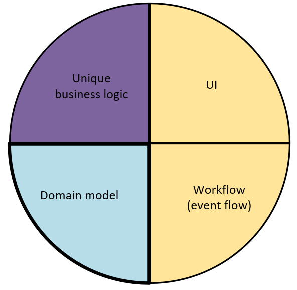
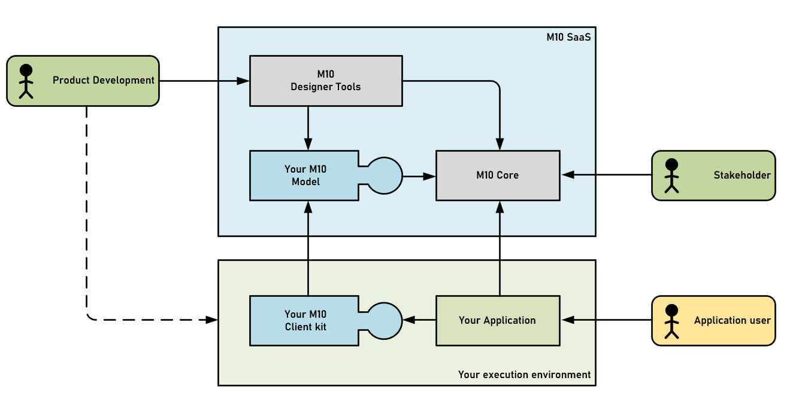

# M10
_Concept description_  

## Why do we need this?
The development of any typical enterprise application comprises (at least) the following four tiers:  

<picture>

</picture>

In an ideal world, we are striving to reduce the effort to implement support for the areas that are actually not our own, unique business logic, but are merely there to facilitate the livelihood of the application. One such area is typically the domain tier. As the domain tier is maybe the most obvious one we need, it is also the one that we have all heard about, repeatedly. The domain tier is there to represent the data we want to manage in our application. Data, incarnated in various shapes and protocols, depending on where this data is supposed to be used.  

Let’s look at a very simple example: a customer register. From the top, in the UI, we need a JSON representation of a customer; with name, address, people for contact keeping, and maybe some other fields, like VAT registration number or the date for the latest security audit, formatted for the UI user's time zone:  
```JSON
{
    "Customer" : "NASA",
    "Adress"   : "Mare Tranquilitatis",
}
```
When the UI has done what it’s supposed to do, this data is pushed further down the line, through the web API and to the middleware, where it’s processed. This processing could be concerning validation of data, running business rules, encryption of sensitive information and making sure we satisfy other aspects, like logging and enforcing access rights. For this purpose, the data will at this level be represented as something similar as in the UI, but not identical. So, another, parallel implementation of carrying of this data will be needed, maybe in C#, Java or Python:  
```C#
 public class Customer : BusinessObject
 {
     public string CustomerName { get; set; }
     public Adress Adress { get; set; }	
 }
```
Finally, we want to store this data for later use, and for sharing with others. Thus, we put that data into a database. Again, this data must be revamped to fit the rules of how data in an RDBMS is stored. Hence, we need a third variant of that same data. In 9 out of 10 cases, it means SQL:  
```SQL
CREATE TABLE Customers (
    CustomerName NVARCHAR2(24),
    Adress NVARCHAR2(128)
);
```
Imagine now, a more realistic application that can do more things than just storing customers in a flat register. We might have 20-50 various domain abstractions of things like accounts, business transactions, meteorological data, spare parts lists for a machine, children’s clothes and other articles and so on. To make things worse – take this times three (to make sure we can support the typical flow that was mentioned above).  

We are challenged to spend time on something that is there just to make sure the important parts of our application can do what it’s supposed to do. Of course, there is a finite number of domains out there already. Who hasn’t seen an accounting software in action? Or an airline reservation system? Or what you need to use to order a new water pump for your car? Couldn’t we just make sure someone could produce a library of holistic and chiseled, ready-to-use implementations for all of these well known domains? Then, this problem could be solved once and for all, and we could focus on the more interesting stuff in the future.  

Well, the devil is in the details. How many different accounting software can we find on the market today? Hundreds? Maybe even thousands? And they are all similar, but never identical. The reasons for deviations could be commercial, legal or due to the fact that the software needs to fit into other parts of a product line. By trying to create a prefab domain model to fit everyone's needs, we would end up with something that wouldn't fit anyone's.  

So, every day, there is a `Customer` data model designed and implemented somewhere in the world. And an `Account` data model. The wheel is reinvented, over and over again, every day. And every one of them similar, but with a slightly different flavor. This generates a lot of work. Not just for the very one-off implementation, but also for testing, maintenance, diagnostics, optimization. Not to mention when we migrate from one system to another, handling almost the same type of data.  

What if we could find a way to automate this process? To use a tool where we only have to spend the time to define what the model should manage, but where the rest of the work is done by this tool? Where we could, at the click of a button, get all the plumbing needed to make it work. A coherent data model, valid for all the layers in an application, with all the needed aspects covered, and running with decent performance in a production scenario.  

And not just that. What if could adopt a black box paradigm, where we at one end push all the requirements of the model, and where we at the other end get a ready to use service, that will handle precisely that?

## How it’s used

We need to understand the concepts around how you work with M10. First of all, M10 is a cloud based service, that is used from two different perspectives:  
1. A service your organization will use, to craft the domain model for your application. This is a part of your product development process.
2. A service that your application will consume, to in turn satisfy the needs for your end customers. Quite similar to any other SaaS product out there, such as S3 storage, a cloud based RDMBS etc.  
Here is a simplified view of the most important concepts:  
<picture>

</picture>

The two most important consumers/personas, are the people involved in the product development, and the people that will indirectly use M10, using your application. As the M10 is a live system, always up and running, there might also be stakeholders in your organization that wants to access other data around your M10 application , such as getting usage metrics or billing statistics, or by subscribing to system events and alerts, etc.  

So, let's now break it down further.  

### The modeling environment

The closest analogy would be...


### The runtime environment

To provide the services you need to host your domain model, M10 runs inside a cloud environment, (i.e. Azure or equivalent). However, this is implementation details, that the consumer of M10 doesn't have to be concerned about. Like when using veideo streaming services, you just care about watching your videos, and are now bothering about what's going on behind the curtains.


### The presentation layer

This is most likely the most interesting part, when it comes to daily operation.  


## Being the Devil's advocate

This sounds great! But, aren't we running in circles here? Isn't there already solutions for this problem?  
And if there isn't, how come? This problem has been around for decades already.  

### ORMs

The problem of transforming a domain model into an SQL database already has a solution; an object-relational-mapper (ORM).  

Well, not really...

### CMSs

Well, not really


### A tall order

This sounds like a mouthful. Could we really pull this off?  

The trick is:  
1. Divide and conquer.  
2. Utilize abstractions, both second and third order ones.  
3. Not trying to solve a specific problem.  
4. Leave room for still not invented aspects.  
