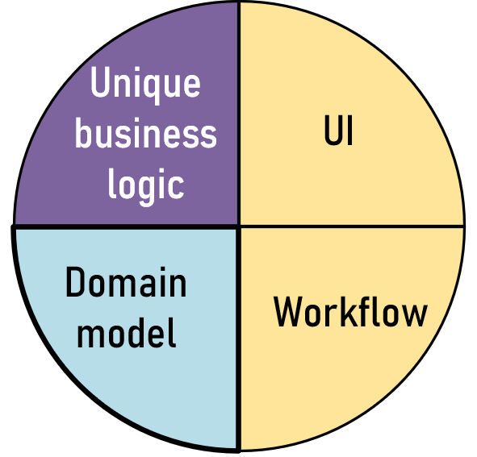
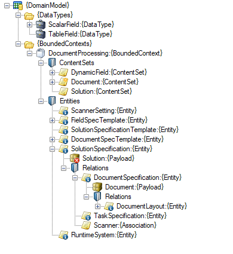

# M10
_Concept description_  

## Why do we need this?
The development of any typical enterprise application comprises (at least) the following four tiers:  

<picture>

</picture>

To become successful, in an ideal world, we want to put more effort on those parts that make our application unique and can convey its selling points, whereas the parts that have to be there regardless, and could be found in any other similar application, should require less attention and effort. The tier that makes up the unique business logic is undoubtedly one of them. The domain tier lies in the twilight zone, however. But no matter what, it has to be there. Data, incarnated in various shapes and protocols, depending on where this data is supposed to be used.  

### Data as a rendition

Let’s look at a very simple example: a customer register. From the top, in the UI, we need a representation of a customer; with name, address, people for contact keeping, and maybe some other fields, like VAT registration number or the date for the latest security audit, formatted for the UI user's time zone. Today, this might typically be expressed in a JSON format:  
```JSON
{
    "Customer" : "NASA",
    "Adress"   : "Mare Tranquilitatis",
}
```
When the UI has done what it’s supposed to do, this data is pushed further down the line, through the web API and to some middleware, where it’s processed. This processing could be concerning validation of data, running business rules, encryption of sensitive information and making sure we satisfy other aspects, like logging and enforcing access rights. For this purpose, the data will at this level be represented as something similar as in the UI, but not identical. So, another, parallel implementation of carrying of this data will be needed, maybe in C#, Java or Python:  
```C#
 public class Customer : BusinessObject
 {
     public string CustomerName { get; set; }
     public Adress Adress { get; set; }	
 }
```
Finally, we want to store this data for later use, and for sharing with others. Thus, we put that data into a database. Again, this data must be revamped to fit the rules of how data in an RDBMS is stored. Hence, we need a third variant of that same data. In 9 out of 10 cases, it means SQL:  
```SQL
CREATE TABLE Customers (
    CustomerName NVARCHAR2(24),
    Adress NVARCHAR2(128)
);
```
Imagine now, a more realistic application that can do more things than just storing customers in a flat register. We might have 20-50 various domain abstractions of things like accounts, business transactions, meteorological data, spare parts lists for a machine, children’s clothes and other articles and so on. To make things worse – take this times three (to make sure we can support the typical flow that was mentioned above).  

### Data as a behavior

In the example above it might be tempting to preemptively conclude that, if the problem of data conversion and layering can be solved, then we are done. Maybe, if it was only as simple as using data in a declarative way. But, in real-world applications, we also need to think about the process around how this data is conveyed and reshaped.  

Some common challenges we need to deal with:  
* How is a set of data related to other sets? What will happen to relations between for instance, a customer record and a customer transaction, if the customer is removed from our storage?  
* How is the description of the data maintained, and how will this affect already existing data? For instance, what will happen to our existing account ledger, if we introduce a tax column, mandatory for the fiscal year of 2026 and onward? Or, if we deprecate a column due to GDPR compliance?  
* What will happen if two users want to alter a piece of data, simultaneously? Should someone’s data be silently overwritten? Or, do we accept a system crash in those, after all, rare occasions?

One will quickly realize, that all requirements related to our data's behavior must be carefully designed and put to life. However, many of these processing and behavioral aspects will re-appear, if we were about to visit another application's domain tier. The challenge of how to deal with "holes" in our data after removal, has to be dealt with, regardless if we are dealing with car spare parts of flight schedules. Maybe the _solution_ will not be the same, but considerable amounts of effort has to be spent to not leave this to chance. On the other hand, some solution concept for the concurrency challenge in a dentist patient's file might re-appear again in a system dealing with fruit pallets in a super market, albeit obscured by the fact that these data themselves are not even remotely related. Nevertheless, an identical spution pattern might be adopted, without the creators of these two systems knowing it.   

### What if?

So, every day, there is a `Customer` data model designed and implemented somewhere in the world. And an `Account` data model. The wheel is reinvented, over and over again, every day. And every one of them similar, but with a slightly different flavor. This generates a lot of work. Not just for the very one-off implementation, but also for testing, maintenance, diagnostics, optimization. Not to mention when we migrate from one system to another, handling almost the same type of data.  

Of course, there is a finite number of domains out there already. Who hasn’t seen an accounting software in action? Or an airline reservation system? Or what you need to use to order a new water pump for your car? Couldn’t we just make sure someone could produce a library of holistic and chiseled, ready-to-use implementations for all of these well known domains? Then, this problem could be solved once and for all, and we could focus on the more interesting stuff in the future.  

Well, the devil is in the details. How many different accounting software can we find on the market today? Hundreds? Maybe even thousands? And they are all similar, but never identical. The reasons for deviations could be commercial, legal or due to the fact that the software needs to fit into other parts of a product line. By trying to create a prefab domain model to fit everyone's needs, we would end up with something that wouldn't fit anyone's.  

What if we could find a way to automate this process? To use a tool where we only have to spend the time to define what the model should manage, but where the rest of the work is done by this tool? Where we could, at the click of a button, get all the plumbing needed to make it work. A coherent data model, valid for all the layers in an application, with all the needed aspects covered, and running with decent performance in a production scenario.  

And not just that. What if could adopt a black box paradigm, where we at one end push all the requirements of the model, and where we at the other end get a ready to use service, that will handle precisely that?

## So, what _is_ it?

Before continuing further, it might perhaps be helpful for the understanding of what M10 is, by first stating what it is **not**:

* It is not a database or a modeling tool for relational databases. Sure, internally, it might use such services, but that is a secondary concern for the user of M10.  
* It is not an object relational mapper (ORM)  
* It is not a finished solution to a specific domain or a business problem, but instead the tool to solve a wide range of problems.  
* It is not a software library that is supposed to be downloaded and bundled as a part of your own software. Eventually, some parts of your own M10 solution, will be consumed as a tailor-made client access toolkit, but it will still require the running SaaS backbone to operate.  
* It is not a template infrastructure where concrete solutions are to be produced with a cloning or copy-paste approach. It is meant to be used, not re-used.  
 

## How it’s used

First of all, M10 is a cloud based service, that is used from two different perspectives:  
1. A service your organization will use, to craft the domain model for your application. This is a part of your product development process.
2. A service that your application will consume, while running, to in turn satisfy the needs for your end customers. Quite similar to any other SaaS product out there, such as S3 storage, a cloud based RDMBS etc.  

The entry point to all of this would be your M10 client portal, which is accessed using your M10 user account.  

Here is a simplified view of overall concept:  
<picture>

</picture>

The two most important consumers/personas, are the people involved in the product development, and the people that will indirectly use M10, as clients to your application. As the M10 is a live system, always up and running, there might also be stakeholders in your organization that want to access other data around your M10 application, such as getting usage metrics or billing statistics, or by subscribing to system events and alerts, etc.  

So, let's now go through the usage concepts.

### The designer tools

This is the M10 modeling environment, and it's also where you start when you want to either write new software from scratch, or when modifying an existing piece of software to start taking advantage of M10.  

You will go into the M10 modeling environment, from the client portal. An extensive access rights infrastructure will define who can work with what. The designer could be used in two different ways:  
* An interactive, GUI based modeling studio, where you work with your model at your own pace.   
* A scripting tool sandbox, where you could automate tasks, or when you want to adhere to an IbC methodology of software development.  

Either way is mutually exchangable and has the identical feature set. Inside the interactive GUI, it could look like something like this:  
 
 
<picture>

</picture>


If we start with the aspect of defining the domain model, the most common function areas in the designer tool would be:  
1. Define your domain objects, such as `Customer`, `Inventory`, `Sales transaction` etc.  
2. Define and explore what kinds of relations you want to create between your domain objects. Typical relations could be ownership, inheritance or sharing, to mention some examples.  
3. Define the content of these domain objects. That means; what property fields you would need, and what high level data types are carried by such fields. Other rules could also apply, for instance how some fields should comply to GDPR regulations and/or security measures.  
4. Define life cycle rules for the domain objects. What should happen when things are deleted, duplicated or updated?  
5. Define operational behavior, such as defining the rules for concurrency, or define triggers and events.    
6. Define transactional-commercial policies, which might be needed to determine how you should bill _your_ customers.  
7. Create and adopt an access right model, if needed.  
8. Define versioning policies. This is usually always needed, because the actual data that your application is working with, will have meta data that is going to be updated and modified. E.g. what should happen with an existing `Customer` record if you determine to add one more field to it later?  
9. Define to what extent you want to monitor and obtain metrics in the running application.  

For many of these function areas, it will be possible to test/simulate on the fly how the model behaves when feeding it with sample data.

When we are satisfied with a starter domain model, we can now use the aspect of how the model should be accessed by and presented to your application. See section [The presentation layer](#The-presentation-layer), below.  


### The runtime environment

To provide the services you need to host your domain model, M10 runs inside a cloud environment, (i.e. Azure or equivalent). However, this is implementation details, that the consumer of M10 doesn't have to be concerned about. Like when using video streaming services, you just care about watching your videos, and are now bothering about what's going on behind the curtains. Each client, is accessing their M10 sandbox through a separate subscription.  

The M10 cloud services will provide a presentation of your domain model, in a safe way, only accessible to authorized clients. Typically, you wouldn't expose M10 available endpoints to your end users, but more likely to the parts of your application that wants to consume those services.  


### The presentation layer

When we say presentation layer, it's not referring to a GUI or a web page, but to that part of the M10 solution that is accessible at runtime.
This is most likely the most interesting part, when it comes to daily operation. A lot of different options are available:  
1. As a regular set of REST API endpoints, where you have access to the rendition of the model that you have worked on in the designer, but now revamped into a shape where it is REST compatible. Here, in turn, M10 could be consumed as a data provider service, where you add your own presentation API on top of M10, and additional layers. But it would also possible to use M10 directly, as the layer feeding your UI.  
2. Through a client kit. If your solution is shipping as a Mac or Windows desktop app, or even a mobile app, you might want to eliminate tedious and error prone plumbing, and tampering with raw JSON entities. And you might also want to take advantage of strongly typed and dynamic mechanisms available in the language of your choice, such as .NET events. For this, a client SDK kit will be available. This kit will be custom built to exactly match the domain model, and downwloadable from the portal.  


## WIP: Being the Devil's advocate

This sounds great! But, aren't we running in circles here? Isn't there already solutions for this problem?  
And if there isn't, how come? This problem has been around for decades already.  

### ORMs

The problem of transforming a domain model into an SQL database already has a solution; an object-relational-mapper (ORM).  

Well, not really...  
It is not taking care of the problem, that goes outside the SQL realm.

### Headless CMSs

Well, not really...  

A CMS is very focused on providing services for web publications. But what if you want to interact with the data flow iself? What if you want to in detals control the materialization and life cycle behavior of your domain objects?


### A tall order?

This sounds like a mouthful. Could we really pull this off?  

Let's look at some abstraction levels, following an example. Using null:th order abstractions, we would have code in the shape of something like this:  
```C#
class TravelExpense
 ```  
Great. Very easy to understand, but that might be the only benefit. You would have to write a new class for every new occurence of an account type, which would be extremey inflexible. So, let's go to a first order abstraction:  
```C#
class Account<TravelExpense>  
```
This is still quite comprehensible. However, what is unique to a travel expense, unlike a purchase order expense, has to be dealt with using application code. This is also very acceptable, and in fact usually how it's done. But, as soon as you want to introduce a new concept, say `Payment`, you need to write and test new code, even if 90% of the content coincides with `Account`. So, let's take this a step further. Look at all entities in the system from one unified point of view, using a second order abstraction approach:  
```C#
class Entity<AccountType> 
```
What we have won, is the power to be able to create new entity types with much less effort. What we have lost, however, could be that the semantics of working with these abstractions become a bit quirky. Not to mention performance aspects, if we still want to stay aligned with regular SQL and ORM infrastructures.  

Before we push ourselves into the third order realm, let's recap what we are aiming for. To have something that can serve any need for a domain model, without having to reinvent the wheel. But things are starting to get tricky when we introduce relations between domain objects, and when we stack those relations on top of one another. Maybe the entity representing musiscian, referring to a set of concert halls they are playing in, has a relation that doesnt work if the entity in question is a document, residing in a folder. Then we, would have to create one `EntityWithOwnerShip`, one `EntityWithMembership` etc. This quickly become a mess, and we haven't won anything. No, we need further decoupling (provided that we can manage that decoupling in an acceptable way):  
```C#
class ChapterTemplate<EntityType, RelationType>  
```
This will become quite flexible and quite reusable. But, wait! What have we lost? In fact, a lot. It becomes very tedious to work with these abstractions in your application's source code. And strong typing goes out the window. At least, as long as we are adhering to some 1-1 mapper paradigm.
```C#
myEntity.Content<AccountType>.SetValue("VatAmount", 67.76);
```
instead of just saying
```C#
myAccount.VatAmount = 67.76;
```
So without adding surrounding ecosystems or fixtures to carry your domain model from the client side, all the way down to a storage level, the applicability might easily become purely academic.  

But we can do that. However, in analogy with going from first to second order abstraction to cover any type of entity, instead of just accounts, we need to go from third to fourth order to cover any type of fixture. So, basically, something like:   
```C#
class ChapterTemplate : NarrationSection<Conditional, ...  
```
For each abstraction order we increase, we have to add our own housekeeping infrastructures to be able to "find our way home", and to stay on track when it comes to satisfy operational requirements, where performance would be the most obvious. So, if we want to express a domain model using a `ChapterTemplate` approach, we cannot just store an anonymous structure in an SQL database called `ChapterTemplates`, and consume them directly from an M10 presentation layer. That would be astronomically slow. No, we would have to spin up a live environment, fed with meta data from the `ChapterTemplate` model, but rendering itself as an `Account`, when it's exposed to the API consumer.  

But this is exactly what M10 does for you.  

The trick is:  
1. Divide and concquer.  
2. Utilize abstractions, both second and third order ones.  
3. Not trying to solve a specific problem.  
4. Leave room for still not invented aspects.  

TBA
